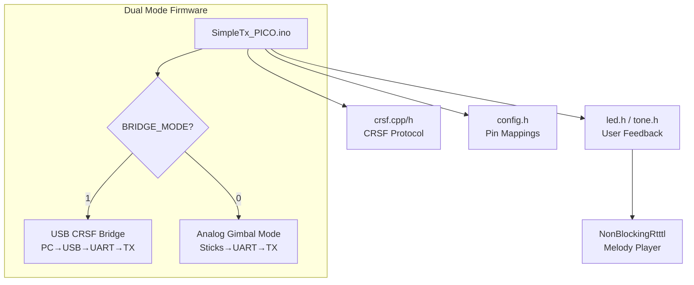

# ELRS-Pico-Transmitter: Zephyr RTOS Port Plan

## Overview

This plan details converting the existing Arduino-based ELRS Pico Transmitter firmware to run on **Zephyr RTOS**, targeting the RP2040/RP2350 (Raspberry Pi Pico). The current firmware is ~600 lines of C++ across 7 files, using Arduino APIs heavily.

---

## Current Architecture Summary



| File | Lines | Purpose |
|------|-------|---------|
| [SimpleTx_PICO.ino](file:///c:/Users/harit/ELRS-Pico-Transmitter/Firmware/SimpleTx_PICO/SimpleTx_PICO.ino) | 272 | Main firmware, mode selection |
| [crsf.cpp](file:///c:/Users/harit/ELRS-Pico-Transmitter/Firmware/SimpleTx_PICO/crsf.cpp) | 193 | CRSF parser & frame builder |
| [config.h](file:///c:/Users/harit/ELRS-Pico-Transmitter/Firmware/SimpleTx_PICO/config.h) | 99 | Hardware pin definitions |
| [tone.h](file:///c:/Users/harit/ELRS-Pico-Transmitter/Firmware/SimpleTx_PICO/tone.h) | 74 | Buzzer audio feedback |
| [NonBlockingRtttl.cpp/h](file:///c:/Users/harit/ELRS-Pico-Transmitter/Firmware/SimpleTx_PICO/NonBlockingRtttl.h) | ~230 | RTTTL melody parser |

---

## Arduino → Zephyr API Mapping

### Core Timing
| Arduino | Zephyr | Notes |
|---------|--------|-------|
| `millis()` | `k_uptime_get()` | Returns `int64_t` ms |
| `micros()` | `k_uptime_get() * 1000` or `k_cycle_get_32()` | Use cycle counter for µs precision |
| `delay(ms)` | `k_msleep(ms)` | Blocking sleep |
| `delayMicroseconds(us)` | `k_busy_wait(us)` | Busy-wait loop |

### GPIO
| Arduino | Zephyr | Notes |
|---------|--------|-------|
| `pinMode(pin, OUTPUT)` | `gpio_pin_configure(dev, pin, GPIO_OUTPUT)` | Requires `gpio_dt_spec` |
| `pinMode(pin, INPUT_PULLUP)` | `gpio_pin_configure(dev, pin, GPIO_INPUT \| GPIO_PULL_UP)` | |
| `digitalWrite(pin, val)` | `gpio_pin_set(dev, pin, val)` | |
| `digitalRead(pin)` | `gpio_pin_get(dev, pin)` | |

### ADC (Analog)
| Arduino | Zephyr | Notes |
|---------|--------|-------|
| `analogReadResolution(12)` | ADC channel config with 12-bit resolution | Set in devicetree or `adc_channel_setup()` |
| `analogRead(pin)` | `adc_read(dev, &seq)` → process `adc_buf` | Requires sequence setup |

### UART/Serial
| Arduino | Zephyr | Notes |
|---------|--------|-------|
| `Serial.begin(baud)` | USB CDC ACM device in devicetree | Use `usb_enable()` + UART API |
| `Serial1.begin(baud)` | `uart_configure(dev, &cfg)` | Configure UART1 |
| `Serial.available()` | ISR-driven ring buffer or `uart_poll_in()` | |
| `Serial.read()` | `uart_poll_in()` / `uart_fifo_read()` | |
| `Serial.write(buf, len)` | `uart_poll_out()` loop or `uart_fifo_fill()` | |
| `Serial1.setInvertTX(true)` | PIO-based inversion or external inverter | **⚠️ No native Zephyr API** |

### PWM (Tone)
| Arduino | Zephyr | Notes |
|---------|--------|-------|
| `tone(pin, freq, dur)` | `pwm_set_dt()` with calculated period | Use PWM subsystem |
| `noTone(pin)` | `pwm_set_pulse_dt(0)` | |

### EEPROM / Flash Storage
| Arduino | Zephyr | Notes |
|---------|--------|-------|
| `EEPROM.begin(size)` | Use NVS (Non-Volatile Storage) or Settings subsystem | |
| `EEPROM.read(addr)` | `nvs_read(fs, id, data, len)` | |
| `EEPROM.get(addr, obj)` | `nvs_read()` with struct | |
| `EEPROM.put(addr, obj)` | `nvs_write()` | |

---

## Proposed Zephyr Project Structure

```
elrs-pico-tx-zephyr/
├── CMakeLists.txt
├── prj.conf                 # Kconfig: Enable UART, ADC, PWM, USB, NVS
├── boards/
│   └── rpi_pico.overlay     # Devicetree overlay for pin mappings
├── src/
│   ├── main.c               # Entry point, setup, main loop
│   ├── crsf.c / crsf.h      # CRSF protocol (mostly portable)
│   ├── config.h             # Zephyr devicetree aliases
│   ├── bridge_mode.c        # USB→UART bridge logic
│   ├── gimbal_mode.c        # ADC→UART analog input logic
│   ├── led.c / led.h        # LED control via GPIO
│   ├── buzzer.c / buzzer.h  # PWM-based tone generation
│   └── storage.c            # NVS-based calibration storage
└── Kconfig                  # Custom config options
```

---

## Proposed Changes

### 1. Project Setup
#### [NEW] CMakeLists.txt
- Standard Zephyr CMake structure
- Link required Zephyr subsystems

#### [NEW] prj.conf
```ini
CONFIG_GPIO=y
CONFIG_ADC=y
CONFIG_PWM=y
CONFIG_SERIAL=y
CONFIG_UART_INTERRUPT_DRIVEN=y
CONFIG_USB_DEVICE_STACK=y
CONFIG_USB_CDC_ACM=y
CONFIG_NVS=y
CONFIG_FLASH=y
CONFIG_FLASH_MAP=y
```

#### [NEW] boards/rpi_pico.overlay
- Define UART1 pinmux (GP0/GP1)
- Define ADC channels (GP26-GP29)
- Define PWM for buzzer (GP10)
- Set aliases for easy code access

---

### 2. Core Firmware Port

#### [NEW] src/main.c
- Zephyr `main()` entry
- Initialize all subsystems
- Call mode-specific `setup()` and `loop()` in `while(1)`

#### [MODIFY] crsf.cpp → [NEW] src/crsf.c
- Remove `#include <Arduino.h>`
- Replace `Serial1.write()` with Zephyr UART API
- CRC and parser logic is pure C, mostly portable

#### [NEW] src/bridge_mode.c
- USB CDC read → UART1 write
- UART1 read → USB CDC write (reverse bridge)
- Failsafe injection using `k_uptime_get()`

#### [NEW] src/gimbal_mode.c
- ADC sequence read for 4 analog channels
- GPIO read for switches
- CRSF frame build and UART transmit at 200Hz

---

### 3. Peripheral Drivers

#### [NEW] src/buzzer.c
- PWM-based `tone(freq, duration)` function
- Non-blocking timer for duration tracking
- RTTTL parser port (optional, low priority)

#### [NEW] src/storage.c
- NVS filesystem mount
- `load_calibration()` / `save_calibration()` for `CalibValues` struct

---

## Critical Failure Points & Risks

> [!CAUTION]
> ### 1. UART Signal Inversion (HIGH RISK)
> The ELRS TX module requires **inverted UART** signaling. Arduino's `Serial1.setInvertTX(true)` uses RP2040 hardware inversion.
> 
> **Zephyr Issue:** The standard Zephyr UART driver for RP2040 does NOT expose hardware inversion.
> 
> **Mitigations:**
> - Use **PIO** to implement software UART with inversion
> - Use external **logic inverter IC** (74LVC1G04)
> - Patch the Zephyr RP2040 UART driver to expose inversion registers

> [!CAUTION]
> ### 2. USB CDC ACM Latency (MEDIUM-HIGH RISK)
> The USB-to-UART bridge requires low-latency byte forwarding. Zephyr's USB CDC ACM can have buffering delays.
> 
> **Mitigations:**
> - Use interrupt-driven UART with ring buffers
> - Tune `CONFIG_USB_CDC_ACM_RINGBUF_SIZE`
> - Consider dedicated USB polling thread

> [!WARNING]
> ### 3. ADC Timing and Resolution (MEDIUM RISK)
> Arduino's `analogRead()` is synchronous and blocking. Zephyr ADC is more complex with sequences.
> 
> **Concerns:**
> - 200Hz update rate (5ms period) must be maintained
> - 12-bit resolution must be preserved
> 
> **Mitigations:**
> - Use `adc_read()` in main loop with pre-configured sequence
> - Verify timing with scope or logging

> [!WARNING]
> ### 4. NVS Flash Wear and ID Mapping (MEDIUM RISK)
> EEPROM uses byte addresses; NVS uses 16-bit IDs.
> 
> **Concerns:**
> - ID collision if not carefully mapped
> - Flash sector wear from frequent writes
> 
> **Mitigations:**
> - Map `CALIB_VAL_ADDR` → NVS ID 1, `CALIB_MARK_ADDR` → NVS ID 0
> - Write only on explicit save, not every loop

> [!NOTE]
> ### 5. PWM Tone Frequency Accuracy (LOW RISK)
> PWM peripheral may have frequency granularity limitations for audio tones.
> 
> **Mitigations:**
> - Calculate period from RP2040 clock dividers
> - Test audible output with scope

> [!NOTE]
> ### 6. Build System Complexity (LOW RISK)
> Zephyr's CMake + Kconfig is more complex than Arduino IDE.
> 
> **Mitigations:**
> - Provide complete `CMakeLists.txt` and `prj.conf`
> - Document build steps in README

---

## Effort Estimation

| Component | Complexity | Est. Hours |
|-----------|------------|------------|
| Project scaffolding | Low | 2-3 |
| GPIO/LED port | Low | 1-2 |
| UART port (basic) | Medium | 3-4 |
| **UART inversion (PIO)** | **High** | **8-12** |
| USB CDC bridge | Medium-High | 4-6 |
| ADC gimbal port | Medium | 3-4 |
| NVS storage port | Medium | 2-3 |
| PWM/Buzzer port | Low-Medium | 2-3 |
| Testing & debug | High | 8-10 |
| **Total** | | **~35-50 hours** |

---

## Verification Plan

### Automated Tests
Since this is an embedded firmware port, traditional unit tests are limited. However:

1. **CRSF Parser Unit Tests** (can run on host)
   - Port parser to pure C
   - Write host-side test with known CRSF frames
   - Command: `west build -b native_posix -t run` (if tests added)

### Manual Verification

1. **LED Blink Test**
   - Flash firmware
   - Verify LED blinks on boot (3 fast blinks)
   - Verify LED behavior matches mode (fast blink in bridge, slow in gimbal)

2. **UART Loopback Test**
   - Connect UART TX→RX with jumper
   - Send bytes via USB CDC, verify they echo back
   - Command: Use serial terminal (e.g., `minicom`, `PuTTY`)

3. **ELRS Module Communication Test**
   - Connect to ELRS TX module
   - Use `crsf_viewer.py` to send CRSF frames
   - Verify module LED shows solid (receiving valid CRSF)

4. **ADC Gimbal Test** (Analog Mode)
   - Connect potentiometers to ADC pins
   - Monitor CRSF output with logic analyzer
   - Verify channel values change with pot position

5. **Calibration Persistence Test**
   - Save calibration via stick command
   - Power cycle
   - Verify calibration values are restored

---

## Confirmed Scope

| Decision | User Choice |
|----------|-------------|
| UART Inversion | Software/PIO (no external IC) |
| Target Board | **RP2350 (Pico 2)** |
| Zephyr SDK | Latest |
| Features | **Bridge Mode only** (no gimbal) |
| Buzzer/Melody | Deferred (not essential) |

This reduces scope to: **USB CDC ↔ UART bridge with PIO-based inversion**

---

## LLM vs Manual Work Division

> [!IMPORTANT]
> **Not everything can be reliably "vibe coded"**. Here's what works well with LLM assistance vs what you should handle manually.

### ✅ LLM Can Handle (High Confidence)

| Component | Why It Works |
|-----------|--------------|
| **CRSF Protocol Port** | Pure C logic, no hardware deps. LLM can translate Arduino to Zephyr easily |
| **CMakeLists.txt** | Boilerplate, well-documented patterns |
| **prj.conf** | Kconfig syntax is straightforward |
| **GPIO LED control** | Simple Zephyr GPIO API, many examples |
| **Main loop structure** | Standard `while(1)` pattern |
| **USB CDC read/write** | Zephyr CDC ACM is well-documented |

### ⚠️ LLM Needs Your Verification (Medium Confidence)

| Component | Risk | Your Role |
|-----------|------|-----------|
| **Devicetree overlay** | RP2350-specific pin mappings may have subtle errors | Verify pin numbers against RP2350 datasheet |
| **UART configuration** | Baud rate, pin assignment | Test with logic analyzer or scope |
| **Timing-critical loops** | Failsafe timeout logic | Verify with real ELRS module |

### 🛑 You Should Do Manually (Low LLM Confidence)

| Component | Why Manual | Guidance |
|-----------|------------|----------|
| **PIO UART with Inversion** | Zephyr doesn't have native support. Requires low-level RP2350 PIO programming. LLMs often hallucinate PIO state machine code. | Use [pico-examples/pio/uart_rx](https://github.com/raspberrypi/pico-examples) as reference. Port to Zephyr PIO API. |
| **Initial Build & Flash** | Environment-specific issues (paths, board detection) | Run `west build -b rpi_pico2` yourself, debug errors |
| **ELRS Module Testing** | Requires physical hardware, can't be simulated | Connect module, verify LED behavior, use `crsf_viewer.py` |
| **USB CDC Latency Tuning** | May require trial-and-error with buffer sizes | Adjust `CONFIG_USB_CDC_ACM_RINGBUF_SIZE` based on observed behavior |

---

## Recommended Workflow


### Phase Breakdown

1. **Phase 1: Project Skeleton** (LLM ✅)
   - CMake, Kconfig, devicetree overlay
   - Basic `main.c` with LED blink
   - **You verify:** It compiles and LED works

2. **Phase 2: USB CDC** (LLM ✅, You verify)
   - USB enumeration as serial port
   - Echo test (USB RX → USB TX)
   - **You verify:** Shows up as COM port, echo works

3. **Phase 3: PIO Inverted UART** (YOU 🛑)
   - This is the critical manual step
   - Use RP2350 PIO to implement inverted TX/RX
   - Reference: Raspberry Pi `uart_tx.pio` / `uart_rx.pio`
   - **LLM can help:** Translate pico-sdk PIO to Zephyr wrappers

4. **Phase 4: Bridge Integration** (LLM ✅)
   - Combine USB + UART + CRSF parser
   - Failsafe injection logic
   - **You verify:** With real ELRS module

---

## Why PIO Requires Manual Work

The PIO (Programmable I/O) peripheral is RP2040/RP2350's unique feature. It uses a custom assembly language for state machines. Issues with LLM-generated PIO code:

1. **Hallucination Risk**: LLMs often generate syntactically valid but logically incorrect PIO assembly
2. **Timing Sensitivity**: Inverted UART at 400kbps requires precise cycle counting
3. **Zephyr PIO API**: Less documented than pico-sdk, LLM training data may be outdated

**Your manual task:**
```c
// You'll need to write/adapt this PIO program
.program uart_tx_inverted
    set pindirs, 1
    pull block
    ; ... state machine logic for inverted serial
```

I can provide the Zephyr wrapper code once you have working PIO assembly.
